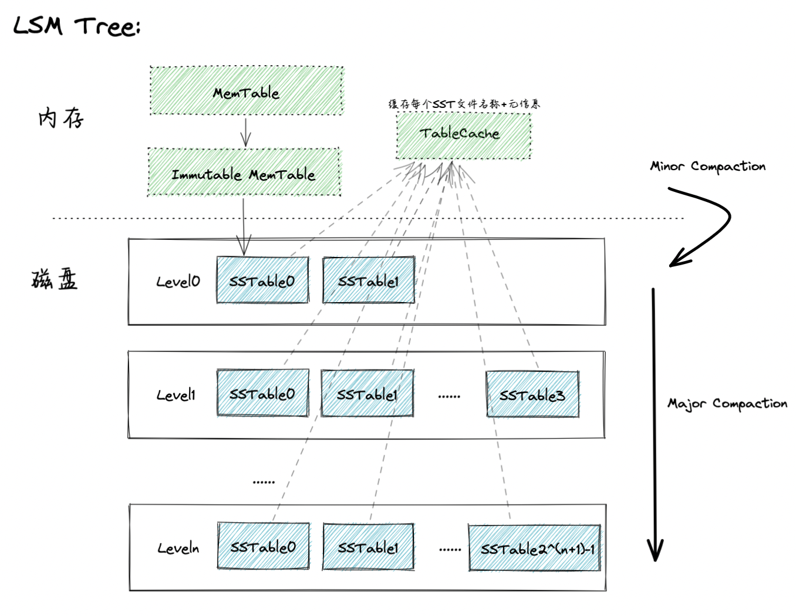
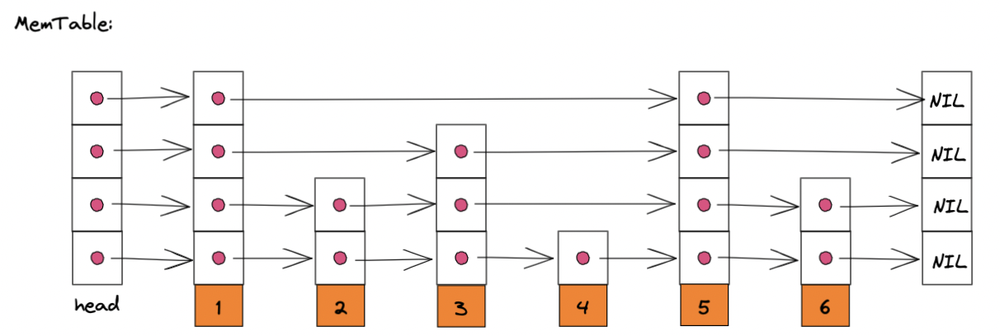
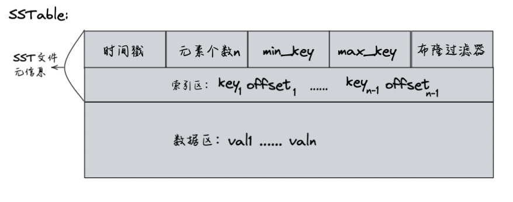
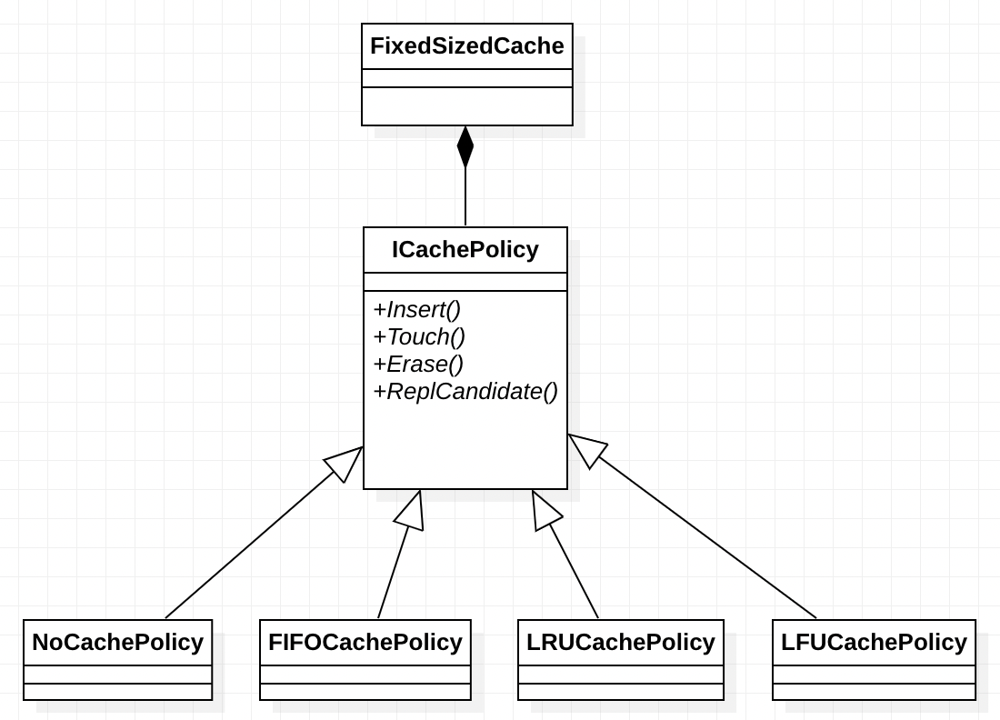

**项目介绍**：该项目是一个基于LSM的存储引擎简易版实现，采用google C++ style编码风格，提供get、put、del接口。

正确性测试：

```shell
# 运行时需要在项目根目录下新建data文件夹或修改路径参数dir
chmod +x build.sh
./build.sh
./bin/correctness
```

## 项目结构

1. SkipList 构成MemTable，提供O(log n)的查找插入效率
2. MemTable 到达设定阈值后转为 Immutable MemTable，dump到磁盘中成为SSTable
3. SStable分层存储（第i层的SST文件个数上限为$2^{(i+1)}, i\geqq0$），Level0层SST文件之间键值范围可以有重叠，但只允许存放两个SSTable。超过两个之后就将其全部合并放入更低层，除Level0层之外的其他层内SSTable键值不允许重叠。



**MemTable的实现结构-跳表**:



**SSTable文件存储格式**:



cache模块架构：



## 实现细节

1. 内存中保存两个跳表，一个用于写数据的MemTable，一个只读的Immutable MemTable，防止当Memtable写满时造成的写阻塞。
2. 后台开启新线程执行Immutable MemTable的MinorCompaction，不影响主线程对MemTable的操作。
3. Compaction时，选择较低层键值重叠的SSTable，执行多路归并，同时对于相同键值的数据，保留时间戳较大的一项
4. 通过Bloom Filter和二分查找提高搜索效率，同时将Bloom Filter和索引部分储存在内存TableCache中，减少磁盘IO
5. 通过线程池，实现异步调用，支持多线程读和单线程写，读取结果返回future

## 接口逻辑

KVStore类核心接口逻辑：

### public 接口**get逻辑**：

`` std::string Get(uint64_t key) override;``

1. 查询cache。如果查到直接返回
2. 查询MemTable。如果查到，val为kDelSign,则表示该key已删除，返回""，否则直接返回val。
3. 查询Immutable MemTable，逻辑同1。
4. 查询TableCache，按L0层到Ln层、每层从SSTable0开始查找，如果找到直接返回，否则继续查找下一个SST文件。对于每个SST文件：
   1. 判断key是否在该SST文件的键值范围[min_key\_, max\_key_]内，如果不是，则进入下一个SST文件的查找
   2. 布隆过滤器查找该key，如果不存在，则进入下一个SST文件的查找
   3. 进入该SST文件的索引区，拿到key和key的下一个键的偏移量offset。读取该SST文件取出key对应的val

> kDelSign为自定义的删除字符串

### public 接口**put逻辑**：

``  void Put(uint64_t key, const std::string &val, bool to_cache = false) override;``

1. 查询key是否已在MemTable，记录使用的内存容量，检测此次put操作是否会超过设定的容量阀值。

   1. 如果不会，直接调用跳表的put接口

   2. 如果会，将该MemTable转为Immutable MemTable，然后新生成一个Memtable，插入该键值对。

      后台启动一个线程，负责将内存中的Immutable MemTable经过minor compaction到磁盘中L0层。

      然后检测L0层的SST文件是否超过了2:

      1. 如果超过，则进行L0层 -> L1层的major compaction。
      2. 如果没有，不进行compaction操作。
   
2. 如果to_cache为true，则缓存该元素

### public 接口**del逻辑**：

`` bool Del(uint64_t key) override;``

``del(key)``调用``put(key, kDelSign)``，由于LSM树异位更新的特性，所有删除操作仅是为key打上一个删除标记。对于该元素的实际删除会在后面的SST文件压缩（Compaction）操作中进行。

### private 接口**MinorCompaction**：

``void MinorCompaction();``

1. 调用跳表的``Store``接口，dump到磁盘
2. TableCache添加新生成SST文件的元信息
3. 调用``MajorCompaction(1)``,检测L0层是否需要压缩

### private 接口**MajorCompaction**：

`` void MajorCompaction(int level);``

1. 检查传入参数level的上一层SST文件数是否超过限制
   1. 如果超过，则将level-1层与level层的SST文件读入内存，进行多路归并
   2. 如果没有超过，直接返回
2. ``MajorCompaction(level+1)``,检测合并后本层的SST文件数量是否超过限制

