- 系统环境：2023 x86_64 GNU/Linux 6.1.41-1-MANJARO
- 编码风格：Google C++ Style
- C++标准：C++20
- 编译器：GCC13.1.0

```shell
# 依赖安装
sudo pacman -S snappy
sudo pacman -S googletest
sudo pacman -S benchmark
yay -S google-crc32c
```

```cpp
# 编译、测试
chmod +x clean.sh
./clean.sh
chmod +x build.sh
./build.sh
chmod +x test.sh
./test.sh
```

使用该项目示例见test/example_test.cc文件。

## 简介

项目架构图：

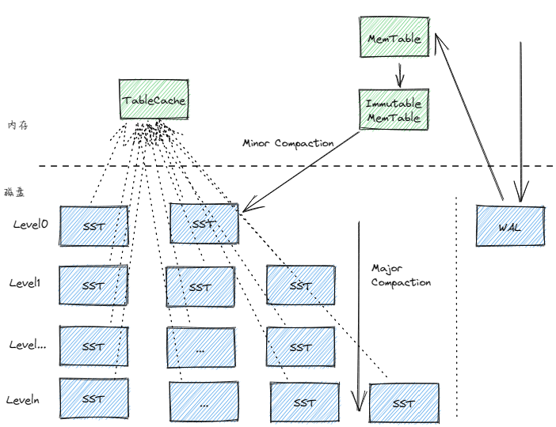


- 内存部分：实现内存分配器Arena类和无锁跳表SkipList类，并以跳表为底层存储结构实现内存表MemTable类。
- 磁盘部分：预写日志、SST文件格式的设计和SST文件compaction实现，并通过MVCC多版本控制解决读写冲突的问题。
- 优化部分：通过Bloom Filter和缓存模块等手段提高读操作效率，同时将Bloom Filter和索引区等SST文件元信息储存在内存TableCache中，减少磁盘IO次数。


## 内容

db/include/status.h中的Status类用于表示命令执行结果状态，其中数据成员state_结构：

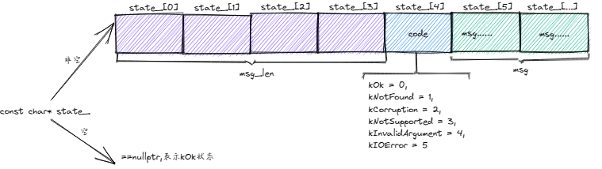


### db/format

项目中关于key的概念：

- user key
- internal key
- lookup key


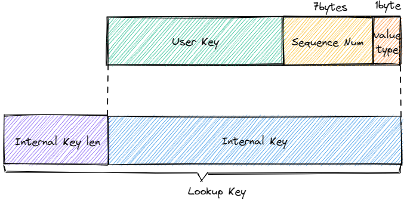

### db/log

预写日志是为了保证内存中数据的完整性，防止机器宕机等情况导致内存中MemTable的数据丢失。

WAL（write ahead log）格式：

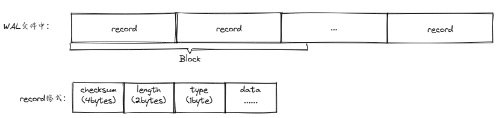


### db/format

### db/filter

采用布隆过滤器加速读操作，主要是对于一些不存在的key可及时返回

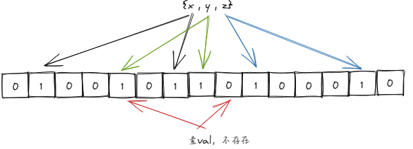

通过Bloom Filter和二分查找提高搜索效率，同时将Bloom Filter和索引部分储存在内存TableCache中，减少磁盘IO

### db/memtable

内存分配器Arena底层结构：

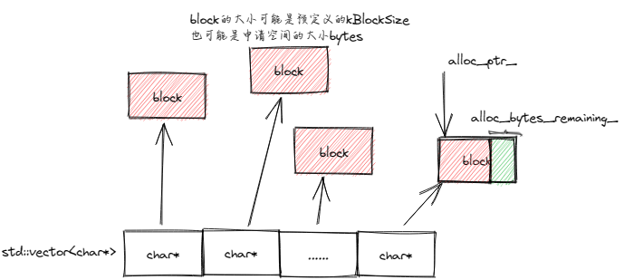

向Arena申请空间流程：

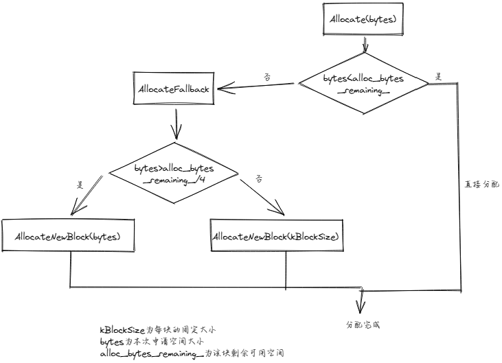

MemTable的底层实现：

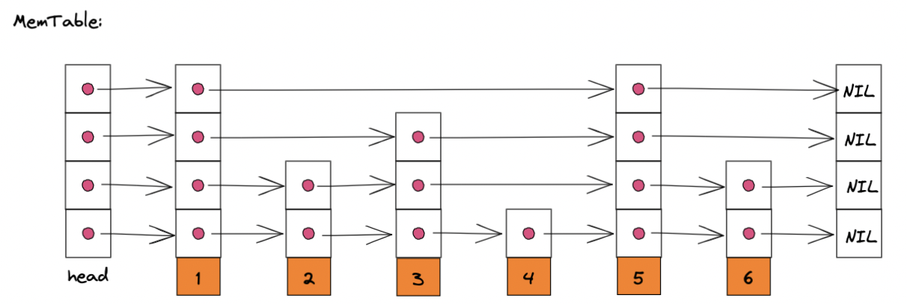

内存中保存两个跳表，一个用于写数据的MemTable，一个只读的Immutable MemTable，防止当Memtable写满时造成的写阻塞。

后台开启新线程执行Immutable MemTable的MinorCompaction，不影响主线程对MemTable的操作。

### db/sst

磁盘中的SST文件由多个`{block, type, crc}`组成（最后还有48字节的`footer`）：

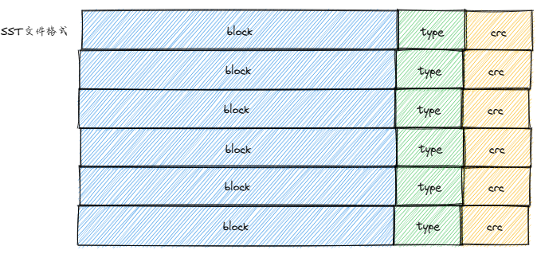

其中`{block, type, crc}`中的`block`可以是`data block`、`meta block`、`meta index block`、`index block`：

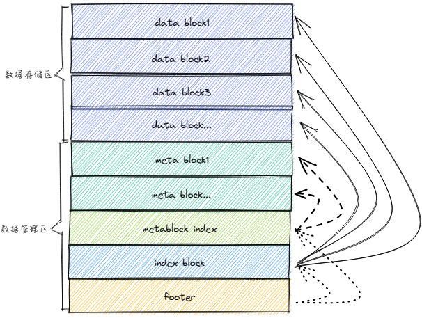

其中`data block`格式：

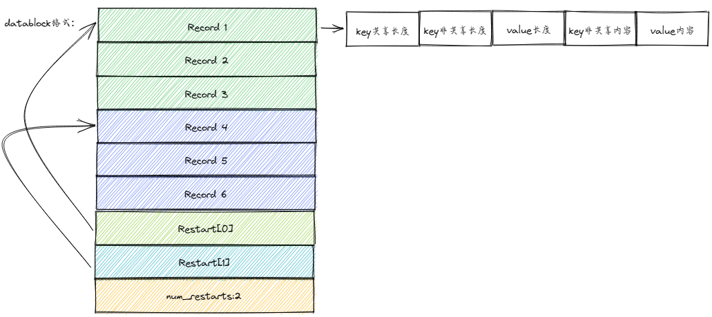

### db/version

`Version`用于表示某次 compaction 或者打开/恢复的数据库状态。

针对共享的资源，这里通过MVCC进行处理。MVCC，MVCC 是一个数据库常用的概念。Multiversion concurrency control 多版本并发控制。每一个执行操作的用户，看到的都是数据库特定时刻的的快照 (snapshot), writer 的任何未完成的修改都不会被其他的用户所看到；当对数据进行更新的时候并是不直接覆盖，而是先进行标记，然后在其他地方添加新的数据(这些变更存储在versionedit)，从而形成一个新版本，此时再来读取的 reader 看到的就是最新的版本了。所以这种处理策略是维护了多个版本的数据的，但只有一个是最新的(versionset中维护着全局最新的seqnum)。

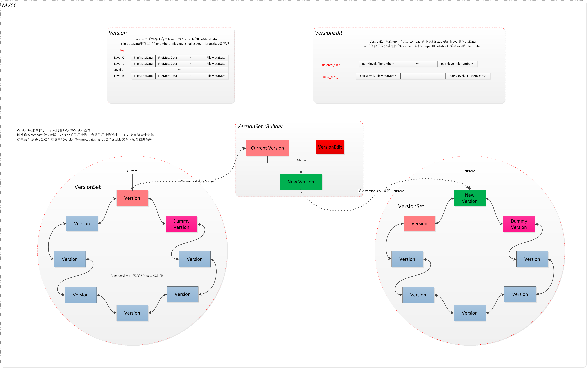


## 存储引擎接口流程

### 接口Get逻辑

``Status Get(const ReadOption& option, std::string_view key,
             std::string* value) override;``

1. 内存中：查询cache。如果查到直接返回
2. 内存中：查询MemTable。如果查到，且valuetype为kDelSign,则表示该key已删除，返回""，否则直接返回val。
3. 内存中：查询Immutable MemTable，逻辑同1。
4. 磁盘上：查询TableCache（对应代码`Version::Get`），按L0层到Ln层、每层从SSTable0开始查找，如果找到直接返回，否则继续查找下一个SST文件。对于每个SST文件：
   1. 判断key是否在该SST文件的键值范围[min_key\_, max\_key_]内，如果不是，则进入下一个SST文件的查找
   2. 布隆过滤器查找该key，如果不存在，则进入下一个SST文件的查找
   3. 进入该SST文件的索引区，拿到key和key的下一个键的偏移量offset。读取该SST文件取出key对应的val


### 接口Put逻辑

``Status Put(const WriteOption& option, std::string_view key,
             std::string_view value);``

查询key是否已在MemTable，记录使用的内存容量，检测此次put操作是否会超过设定的容量阀值。
   1. 如果不会，直接调用跳表的put接口
   2. 如果会，将该MemTable转为Immutable MemTable，然后新生成一个Memtable，插入该键值对。
      后台启动一个线程，负责将内存中的Immutable MemTable经过minor compaction到磁盘中L0层。
      然后检测L0层的SST文件是否超过了2:
      1. 如果超过，则进行L0层 -> L1层的major compaction。
      2. 如果没有，不进行compaction操作。

### 接口Del逻辑

``Status Delete(const WriteOption& option, std::string_view key)``

del接口调用Put接口，由于LSM树异位更新的特性，所有删除操作仅是为key打上一个删除标记（设置Internal Key中的value type为del类型）。对于该元素的实际删除会在后面的SST文件压缩（Compaction）操作中进行。

